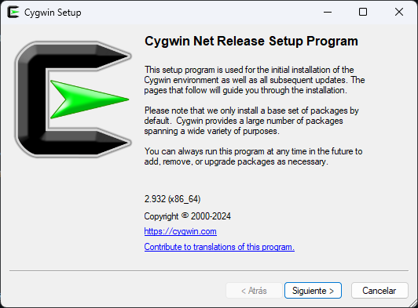
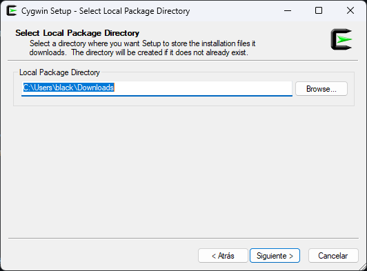
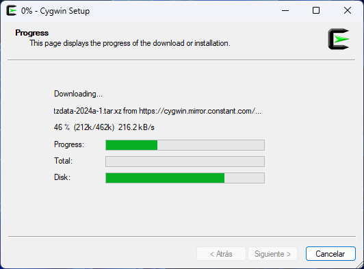
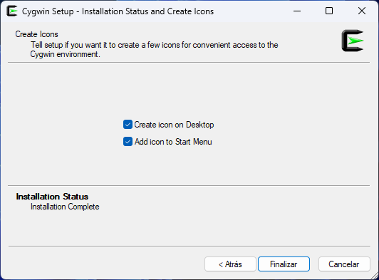
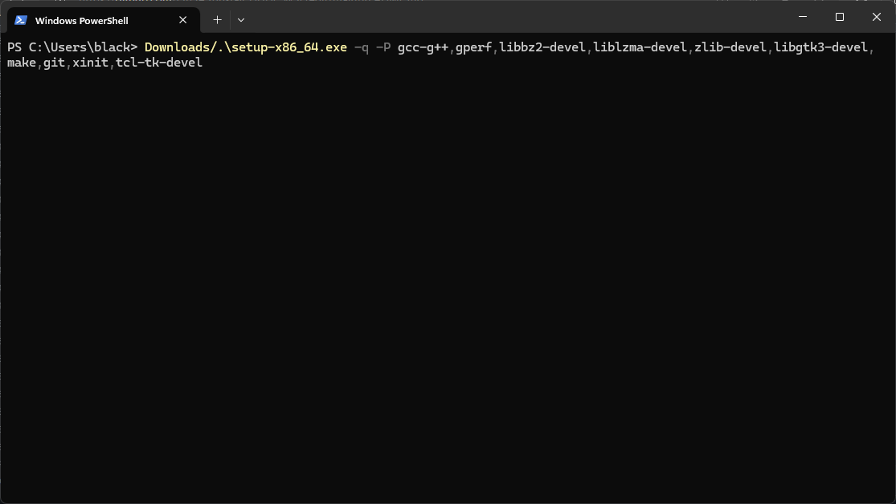
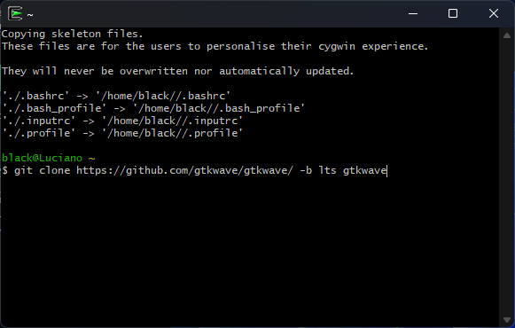

# Instalar GHDL en Ubuntu con WSL
<p align="center">

<image src ="https://github.com/ghdl/ghdl/blob/master/logo/banner.png?raw=true"/>
</p>

````bash
wsl --install
````
### Actualizamos e instalamos dependencias:
````bash
sudo apt update
sudo apt install -y wget zlib1g-dev gnat-10 unzip openjdk-19-jdk gtkwave
````

### Obtenemos GHDL:
````bash
mkdir ghdl
wget https://github.com/ghdl/ghdl/releases/download/v4.1.0/ghdl-gha-ubuntu-22.04-gcc.tgz -P ghdl/
cd ghdl
tar -xzvf ghdl*.tgz
rm g*tgz
````
### Agregamos GHDL a .bashrc:
````bash
cd
echo 'export PATH="$HOME/ghdl/bin:$PATH"' >> $HOME/.bashrc
source .bashrc
````
### Obtenemos Digital un fork de LogiSim:
````bash
cd
wget -c https://github.com/hneemann/Digital/releases/latest/download/Digital.zip
unzip Di*zip
rm Di*zip
````
### Creamos un alias para Digital, asi lo lanzamos escribiendo en la Terminal ```` digital ````:
````bash
cd
echo 'export PATH="$HOME/Digital:$PATH"' >> $HOME/.bashrc
echo 'alias digital=Digital.sh' >> $HOME/.bashrc
source .bashrc
````


# Instalar GHDL en Debian con WSL
<p align="center">

<image src ="https://github.com/ghdl/ghdl/blob/master/logo/banner.png?raw=true"/>
</p>

GHDL Requiere GLIBC 2.34 y Debian Bullseye tiene 2.31 , si instalamos desde Microsoft Store obtendremos Debian Bookworm que viene con GLIBC 2.36.

### Bullseye:
````bash
wsl --install Debian
````
### Actualizamos e instalamos dependencias:
### Bullseye:
````bash
sudo apt update
sudo apt install -y wget zlib1g-dev gnat-10 unzip openjdk-17-jdk gtkwave
````
### Bookworm:
Usando Winget evitamos usar la interfaz grafica
````bash
winget install Debian -s msstore
````
O directamente desde el repo de winget:
````bash
winget install Debian.Debian
````
Lo lanzamos con:
````bash
debian
````
Creamos usuario y contraseña.

### Agregamos temporalmente la repo de Bullseye para obtener gnat-10:
````bash
echo 'deb http://deb.debian.org/debian bullseye main' | sudo tee -a /etc/apt/sources.list
````

### Actualizamos e instalamos dependencias:
````bash
sudo apt update
sudo apt install -y gnat-10
sudo apt install -y wget zlib1g-dev unzip openjdk-17-jdk gtkwave
````
### Eliminamos el repo de bullseye(Opcional, podemos dejarlo):
````bash
sudo sed -i '$ d' /etc/apt/sources.list
sudo apt update
````

### Obtenemos GHDL:
````bash
mkdir ghdl
wget https://github.com/ghdl/ghdl/releases/download/v4.1.0/ghdl-gha-ubuntu-22.04-gcc.tgz -P ghdl/
cd ghdl
tar -xzvf ghdl*.tgz
rm g*tgz
````
### Agregamos GHDL a .bashrc:
````bash
cd
echo 'export PATH="$HOME/ghdl/bin:$PATH"' >> $HOME/.bashrc
source .bashrc
````
### Obtenemos Digital un fork de LogiSim:
````bash
cd
wget -c https://github.com/hneemann/Digital/releases/latest/download/Digital.zip
unzip Di*zip
rm Di*zip
````
### Creamos un alias para Digital, asi lo lanzamos escribiendo en la Terminal ```` digital ````:
````bash
cd
echo 'export PATH="$HOME/Digital:$PATH"' >> $HOME/.bashrc
echo 'alias digital=Digital.sh' >> $HOME/.bashrc
source .bashrc
````


# Instalar GHDL en Windows:
<p align="center">

<image src ="https://github.com/ghdl/ghdl/blob/master/logo/banner.png?raw=true"/>
</p>

- [Verificamos cual es la última versión de GHDL](https://github.com/ghdl/ghdl/latest/releases/)
- [Descarga 32 bit Última version hoy. ghdl-MINGW32 ](https://github.com/ghdl/ghdl/releases/download/v4.1.0/ghdl-MINGW32.zip)
- [Descarga 64 bit Última version hoy. ghdl-UCRT64 ](https://github.com/ghdl/ghdl/releases/download/v4.1.0/ghdl-UCRT64.zip)

- Descomprimimos con el Explorador de Windows.
- O Desde PowerShell se puede descargar y descomprimir con:
  - 32 bit:
    ````bash
    cd Downloads/
    wget https://github.com/ghdl/ghdl/releases/download/v4.1.0/ghdl-MINGW32.zip -OutFile ghdl-MINGW32.zip
    Expand-Archive ghdl*.zip -DestinationPath .
    rm ghdl-MINGW32.zip
    ````
    
  - 64 bit:
    ````bash
    cd Downloads/
    wget https://github.com/ghdl/ghdl/releases/download/v4.1.0/ghdl-UCRT64.zip -OutFile ghdl-UCRT64.zip
    Expand-Archive ghdl*.zip -DestinationPath .
    ````

### El ejecutable quedará en:
- 32 bit: `` Downloads/ghdl-MINGW32/GHDL/bin/ghdl ``
- 64 bit: `` Downloads/GHDL/bin/ghdl `` o `` Downloads/ghdl-UCRT64/GHDL/bin/ghdl ``

### Mover a la unidad C por ejemplo:
#### Con CMD:
- 32 bit
  ````bash
  MOVE Downloads/ghdl-MINGW32/GHDL C:\
  ````
- 64bit
  ````bash
  MOVE Downloads/GHDL C:\
  ````
  Si se descomprime desde el explorador:
   ````bash
  MOVE Downloads/ghdl-UCRT64/GHDL C:\
  ````
  
## Obtenemos Digital un fork de LogiSim:
- Dependencia [Descarga Java Runtime Environment >= 1.8.0](https://javadl.oracle.com/webapps/download/AutoDL?BundleId=249851_43d62d619be4e416215729597d70b8ac)
#### O con Winget:
  ````bash
  winget install "Java 8"
  ````
### Descargando manualmente el zip o desde PowerShell:

- [Descarga ZIP](https://github.com/hneemann/Digital/releases/download/v0.30/Digital.zip)
- Descomprimir con el Explorador de Windows.
- O con PowerShell descargamos y descomprimimos:
  ````bash
  cd Downloads/
  wget https://github.com/hneemann/Digital/releases/latest/download/Digital.zip -OutFile Digital.zip
  Expand-Archive Di*.zip -DestinationPath .
  rm Di*zip
  ````

### Mover a la unidad C por ejemplo:
#### Con CMD:
  ````bash
  MOVE Downloads/Digital C:\
  ````  

## GTKWave
  Visor de diagrama temporal archivo `` .vcd `` generado con GHDL.

### Opción fácil, bajamos una versión antigua, que nos evita compilar GTKWave:
- [Descargar 32 bit](https://sourceforge.net/projects/gtkwave/files/gtkwave-3.3.100-bin-win32/gtkwave-3.3.100-bin-win32.zip/download)
- [Descarcar 64 bit](https://sourceforge.net/projects/gtkwave/files/gtkwave-3.3.100-bin-win64/gtkwave-3.3.100-bin-win64.zip/download)

- Descomprimimos con el Explorador de Windows.
- O Desde PowerShell se puede descargar y descomprimir con:
  - 32 bit:
    ````bash
    cd Downloads/
    wget https://sourceforge.net/projects/gtkwave/files/gtkwave-3.3.100-bin-win32/gtkwave-3.3.100-bin-win32.zip -OutFile gtkwave-3.3.100-bin-win32.zip
    Expand-Archive gtk*.zip -DestinationPath .
    rm gtk*.zip
    ````
    
  - 64 bit:
    ````bash
    cd Downloads/
    wget https://sourceforge.net/projects/gtkwave/files/gtkwave-3.3.100-bin-win64/gtkwave-3.3.100-bin-win64.zip -OutFile gtkwave-3.3.100-bin-win64.zip
    Expand-Archive gtk*.zip -DestinationPath .
    rm gtk*.zip
    ````

  El ejecutable quedará en:
  - 32 bit: `` Downloads/gtkwave/bin/gtkwave ``
  - 64 bit: `` Downloads/gtkwave64/bin/gtkwave ``

### Mover a la unidad C por ejemplo:
#### Con CMD o PowerShell:
- 32 bit
  ````bash
  MOVE Downloads/gtkwave C:\
  ````
- 64bit
  ````bash
  MOVE Downloads/gtkwave64 C:\
  ````
  Agregamos las carpetas a las variable de entorno del Sitema para poder ejecutar desde la Terminal al solo escribir `` ghdl ``, `` Digital ``, `` gtkwave ``.
  - 32 bit:
    ````bash
    setx PATH "%PATH%;C:\GHDL\bin\;C:\Digital\;C:\gtkwave\bin\"
    ````
  - 64 bit:
    ````bash
    setx PATH "%PATH%;C:\GHDL\bin\;C:\Digital\;C:\gtkwave64\bin\"
    ````

### Opción no tan fácil, bajamos el código fuente para compilar una versión más actual(últimos cambios hace 2 días):
#### Cygwin necesario para Compilar GTKWave:
  - [Cygwin](https://www.cygwin.com/install.html)
  - [Descarga directa](https://www.cygwin.com/setup-x86_64.exe)
  - [Instrucciones de instalación](https://gtkwave.github.io/gtkwave/install/win.html)
  - [Instrucciones de compilación](https://gtkwave.github.io/gtkwave/install/unix_linux.html#compiling-and-installing)

### Ejecutamos el instalador:
  1. 
  2. 
  3. 
  4. 
  5. 
  6. 
  7. 
  8. 
  9. 
  10. 
  11. 

#### Una vez instalado usamos Cygwin para instalar las dependencias de GTKWave:
  ````bash
  cd Downloads/
  .\setup-x86_64.exe -q -P gcc-g++,gperf,libbz2-devel,liblzma-devel,zlib-devel,libgtk3-devel,make,git,xinit,tcl-tk-devel,autotools-dev,automake,libJudy-devel
  ````
  12. 
  13. 

### Abrimos la Terminal de Cygwin, clonamos la repo de GTKWave y Compilamos:

  ````bash
  git clone https://github.com/gtkwave/gtkwave/ -b lts gtkwave
  cd gtkwave/gtkwave3-gtk3 && ./autogen.sh
  ./configure --enable-gtk3 --enable-judy
  make -j
  make install
  ````
  14. 

#### Ahora iniciamos XServer para poder ejecutar aplicaciones con GUI:
  ````bash
  startxwin
  ````
Aparecerán 2 iconos de sistemas.
  15. 
  
#### Luego abrimos otra Cygwin Terminal y lanzamos GTKWave:
  ````bash
  gtkwave
  ````
  O desde el icono del Sistema opción Accesorios -> GTKWave
  16. 
  
### Como Desinstalar Cygwin correctamente:
Si el Sistema esta en Español abre CMD:
  ````bash
  takeown /f C:\cygwin64 /r /d s
  icacls c:\cygwin64 /t /grant todos:f
  del /s /q C:\cygwin64
  rmdir /s /q C:\cygwin64
  ````

Si el Sistema esta en Inglés abre CMD:
  ````bash
  takeown /f C:\cygwin64 /r /d y
  icacls c:\cygwin64 /t /grant everyone:f
  del /s /q C:\cygwin64
  rmdir /s /q C:\cygwin64
  ````

- [GHDL](https://ghdl-rad.readthedocs.io/en/latest/examples/quick_start/README.html)
- [Digital](https://github.com/hneemann/Digital/releases/)
- [Manual GTKWave](https://gtkwave.sourceforge.net/gtkwave.pdf)
- [GitHub GTKWave](https://github.com/gtkwave/gtkwave)
- [SourceForge GTKWave](https://sourceforge.net/projects/gtkwave/)
