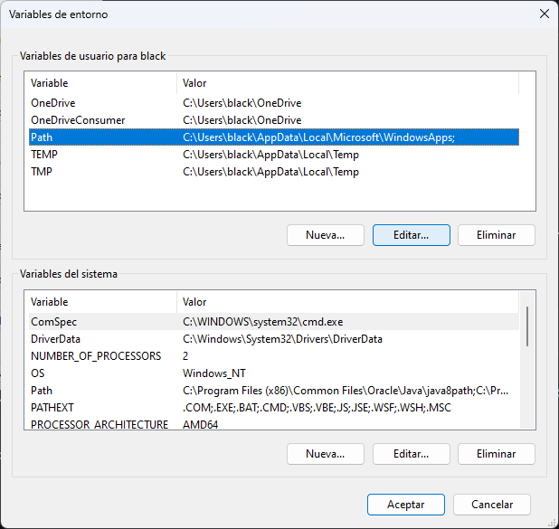
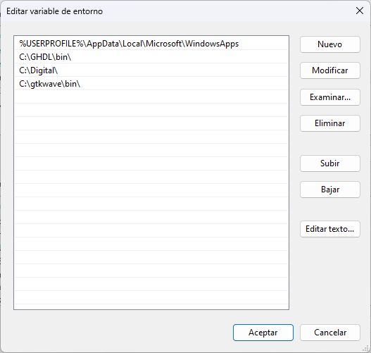
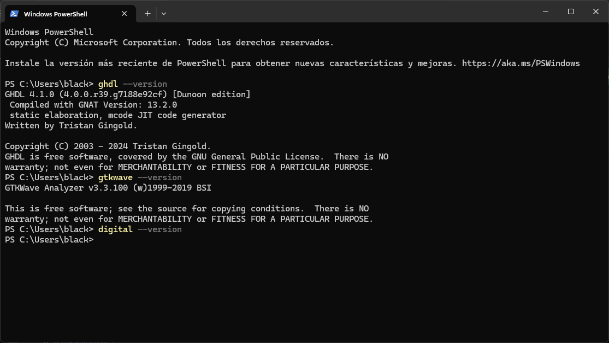
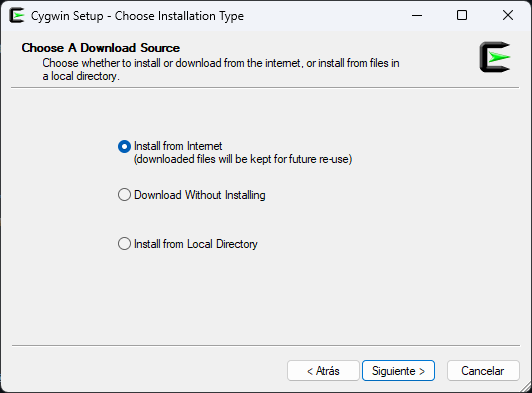
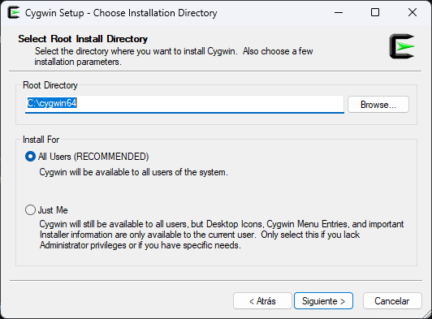
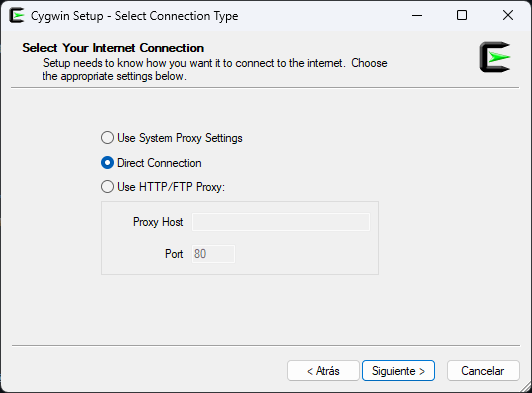
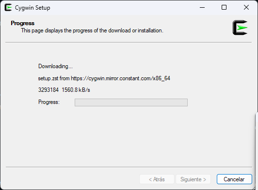
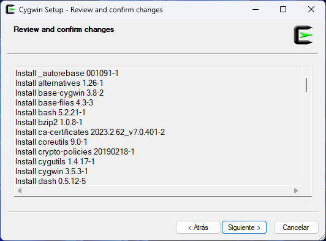

<h1 align="center">Instalar GHDL en Ubuntu con WSL o Linux</h1>

<p align="center">

<image src ="https://github.com/ghdl/ghdl/blob/master/logo/banner.png?raw=true"/>
</p>

- ````bash
  wsl --install
  ````

### Actualizamos e instalamos dependencias:

- ````bash
  sudo apt update
  sudo apt install -y wget zlib1g-dev gnat-10 unzip openjdk-19-jdk gtkwave
  ````

### Obtenemos GHDL:

- ````bash
  mkdir ghdl
  wget https://github.com/ghdl/ghdl/releases/download/v4.1.0/ghdl-gha-ubuntu-22.04-gcc.tgz -P ghdl/
  cd ghdl
  tar -xzvf ghdl*.tgz
  rm g*tgz
  ````

### Agregamos GHDL a .bashrc:

- ````bash
  cd
  echo 'export PATH="$HOME/ghdl/bin:$PATH"' >> $HOME/.bashrc
  source .bashrc
  ````

### Obtenemos Digital un fork de LogiSim:

- ````bash
  cd
  wget -c https://github.com/hneemann/Digital/releases/latest/download/Digital.zip
  unzip Di*zip
  rm Di*zip
  ````

### Creamos un alias para Digital, asi lo lanzamos escribiendo en la Terminal ``digital`` :

- ````bash
  cd
  echo 'export PATH="$HOME/Digital:$PATH"' >> $HOME/.bashrc
  echo 'alias digital=Digital.sh' >> $HOME/.bashrc
  source .bashrc
  ````

<br>
<h2 align="center">$$\texttt{{\color{red} \large{Desinstalar\ todo}}}$$</h2>

- ````bash
  wsl --unregister Ubuntu
  ````
  
<br>
<h1 align="center">Instalar GHDL en Debian con WSL o Linux</h1>

<p align="center">

<image src ="https://github.com/ghdl/ghdl/blob/master/logo/banner.png?raw=true"/>
</p>

GHDL Requiere GLIBC 2.34 y Debian Bullseye tiene 2.31 , si instalamos desde Microsoft Store obtendremos Debian Bookworm que viene con GLIBC 2.36.

### Bullseye:

- ````bash
  wsl --install Debian
  ````

## Actualizamos e instalamos dependencias:
  #### Bullseye:

  - ````bash
    sudo apt update
    sudo apt install -y wget zlib1g-dev gnat-10 unzip openjdk-17-jdk gtkwave
    ````

#### Bookworm:

Usando Winget evitamos usar la interfaz grafica:

- ````bash
  winget install Debian -s msstore
  ````

O directamente desde el repo de winget:

- ````bash
  winget install Debian.Debian
  ````

Lo lanzamos con:

- ````bash
  debian
  ````

Creamos usuario y contraseña.

### Agregamos temporalmente la repo de Bullseye para obtener ``gnat-10`` :

- ````bash
  echo 'deb http://deb.debian.org/debian bullseye main' | sudo tee -a /etc/apt/sources.list
  ````

### Actualizamos e instalamos dependencias:

- ````bash
  sudo apt update
  sudo apt install -y gnat-10
  sudo apt install -y wget zlib1g-dev unzip openjdk-17-jdk gtkwave
  ````

### Eliminamos el repo de bullseye(Opcional, podemos dejarlo):

- ````bash
  sudo sed -i '$ d' /etc/apt/sources.list
  sudo apt update
  ````

## Obtenemos GHDL:

- ````bash
  mkdir ghdl
  wget https://github.com/ghdl/ghdl/releases/download/v4.1.0/ghdl-gha-ubuntu-22.04-gcc.tgz -P ghdl/
  cd ghdl
  tar -xzvf ghdl*.tgz
  rm g*tgz
  ````

### Agregamos GHDL a .bashrc:

- ````bash
  cd
  echo 'export PATH="$HOME/ghdl/bin:$PATH"' >> $HOME/.bashrc
  source .bashrc
  ````

### Obtenemos Digital un fork de LogiSim:

- ````bash
  cd
  wget -c https://github.com/hneemann/Digital/releases/latest/download/Digital.zip
  unzip Di*zip
  rm Di*zip
  ````

### Creamos un alias para Digital, asi lo lanzamos escribiendo en la Terminal ``digital`` :

- ````bash
  cd
  echo 'export PATH="$HOME/Digital:$PATH"' >> $HOME/.bashrc
  echo 'alias digital=Digital.sh' >> $HOME/.bashrc
  source .bashrc
  ````

<br>
<h2 align="center">$$\texttt{{\color{red} \large{Desinstalar\ todo}}}$$</h2>

- ````bash
  wsl --unregister Debian
  ````

<br>
<h1 align="center">Instalar GHDL en Windows</h1>

<p align="center">

<image src ="https://github.com/ghdl/ghdl/blob/master/logo/banner.png?raw=true"/>
</p>

- [Verificamos cual es la última versión de GHDL](https://github.com/ghdl/ghdl/latest/releases/)
- [Descarga 32 bit Última version hoy. ghdl-MINGW32 ](https://github.com/ghdl/ghdl/releases/download/v4.1.0/ghdl-MINGW32.zip)
- [Descarga 64 bit Última version hoy. ghdl-UCRT64 ](https://github.com/ghdl/ghdl/releases/download/v4.1.0/ghdl-UCRT64.zip)

- Descomprimimos con el Explorador de Windows.
- O Desde PowerShell se puede descargar y descomprimir con:
  - 32 bit:
    - ````bash
      cd $HOME\Downloads\
      wget https://github.com/ghdl/ghdl/releases/download/v4.1.0/ghdl-MINGW32.zip -OutFile ghdl-MINGW32.zip
      Expand-Archive ghdl*.zip -DestinationPath C:\
      rm ghdl-MINGW32.zip
      cd ..
      ````
    
  - 64 bit:
    - ````bash
      cd $HOME\Downloads\
      wget https://github.com/ghdl/ghdl/releases/download/v4.1.0/ghdl-UCRT64.zip -OutFile ghdl-UCRT64.zip
      Expand-Archive ghdl*.zip -DestinationPath C:\
      rm ghdl-UCRT64.zip
      cd ..
      ````
Al ver `` cd ..`` presionamos Enter.

### Si descomprimimos con el Explorador de Windows Movemos a la unidad C la carpeta GHDL:

- 32 bit
  - ````bash
    cd $HOME\Downloads\
    Move-Item -Path ghdl-MINGW32/GHDL -Destination C:\
    cd ..
    ````
- 64bit:
  - ````bash
    cd $HOME\Downloads\
    Move-Item -Path ghdl-UCRT64/GHDL -Destination C:\
    cd ..
    ````

#### El ejecutable quedará en:

  ````bash
  C:\GHDL\bin\
  ````
  Usaremos esto después.

## Obtenemos Digital un fork de LogiSim(Al final hay un enlace a un servidor para obtener pre-release version):

- Dependencia [Descarga Java Runtime Environment >= 1.8.0](https://javadl.oracle.com/webapps/download/AutoDL?BundleId=249851_43d62d619be4e416215729597d70b8ac)
- O con Winget:
  - ````bash
    winget install "Java 8"
    ````
  
### Descargando manualmente el zip o desde PowerShell:

- [Descarga ZIP](https://github.com/hneemann/Digital/releases/download/v0.30/Digital.zip)
- Descomprimir con el Explorador de Windows.
- O con PowerShell descargamos y descomprimimos:
  - ````bash
    cd $HOME\Downloads\
    wget https://github.com/hneemann/Digital/releases/latest/download/Digital.zip -OutFile Digital.zip
    Expand-Archive Di*.zip -DestinationPath C:\
    rm Di*zip
    cd ..
    ````
Al ver `` cd ..`` presionamos Enter.
  
### Si descomprimimos con el Explorador de Windows Movemos a la unidad C la carpeta Digital:

  - ````bash
    cd $HOME\Downloads\
    Move-Item -Path Digital -Destination C:\
    cd ..
    ````

### El ejecutable quedará en:

- ````bash
  C:\Digital\
  ````

Usaremos esto después.

### Como editor de texto además de Digital, podemos utilizar Notepad++ que nos permite guardar con la extensión `` .vhdl `` al igual que el bloc de notas, pero detecta la sintaxis:
- [Notepad++](https://notepad-plus-plus.org/downloads/)

- Con Winget:
  - ````bash
    winget install "notepad++"
    ````

## GTKWave
  Visor de diagrama temporal archivo `` .vcd `` generado con GHDL.

### Opción fácil, bajamos una versión antigua, que nos evita compilar GTKWave:
- [Descargar 32 bit](https://sourceforge.net/projects/gtkwave/files/gtkwave-3.3.100-bin-win32/gtkwave-3.3.100-bin-win32.zip/download)
- [Descarcar 64 bit](https://sourceforge.net/projects/gtkwave/files/gtkwave-3.3.100-bin-win64/gtkwave-3.3.100-bin-win64.zip/download)

- Descomprimimos con el Explorador de Windows.
- O Desde PowerShell se puede descargar y descomprimir con:
  - 32 bit:
    - ````bash
      cd $HOME\Downloads\
      Start-BitsTransfer -Source https://sourceforge.net/projects/gtkwave/files/gtkwave-3.3.100-bin-win32/gtkwave-3.3.100-bin-win32.zip/download -Destination gtkwave.zip
      Expand-Archive gtk*.zip -DestinationPath C:\
      rm gtk*.zip
      cd ..
      ````
    
  - 64 bit:
    - ````bash
      cd $HOME\Downloads\
      Start-BitsTransfer -Source https://sourceforge.net/projects/gtkwave/files/gtkwave-3.3.100-bin-win64/gtkwave-3.3.100-bin-win64.zip/download -Destination gtkwave.zip
      Expand-Archive gtk*.zip -DestinationPath C:\
      rm gtk*.zip
      Rename-Item -Path "C:\gtkwave64" -NewName "gtkwave"
      cd ..
      ````
Al ver `` cd ..`` presionamos Enter.

### Si descomprimimos con el Explorador de Windows Movemos a la unidad C la carpeta gtkwave:
  - 32 bit
    - ````bash
      cd $HOME\Downloads\
      Move-Item -Path gtkwave -Destination C:\
      cd ..
      ````
  - 64bit
    - ````bash
      cd $HOME\Downloads\
      Rename-Item -Path "C:\gtkwave64" -NewName "gtkwave"
      Move-Item -Path gtkwave -Destination C:\
      cd ..
      ````
Al ver `` cd ..`` presionamos Enter.
    
### El ejecutable quedará en:
  - ````bash
    C:\gtkwave\bin\
    ````
Usaremos esto después.

### Agregamos las carpetas a las variable de entorno del Sitema para poder ejecutar desde la Terminal al solo escribir `` ghdl ``, `` Digital ``, `` gtkwave ``.
  - Buscamos Variables y nos saldrá el acceso a ``Editar las variables de entorno del sistema``
    
    
    
  - Pulsamos el botón ``Variables de entorno...``

    

  - Se abre una nueva ventana, seleccionamos ``Path`` y pulsamos ``Editar...`` del recuadro superior.
    
    

  - Se abre otra ventana, seleccionamos ``Nuevo``

    

  - Ingresamos las 3 rutas de los ejecutables:
    
    - ````bash
      C:\GHDL\bin\
      ````
    - ````bash
      C:\Digital\
      ````
    - ````bash
      C:\gtkwave\bin\
      ````
    
    

    Pulsamos ``Aceptar`` en cada ventana para cerrarlas.

    Abrimos una Terminal y comprobamos(no es necesario) que obtenemos respuesta al preguntar por las versiones de los ejecutables, excepto en Digital que solo se ejecutará.

    

### Opción no tan fácil, bajamos el código fuente para compilar una versión más actual(últimos cambios hace 2 días):
#### Cygwin necesario para Compilar GTKWave:

  - [Cygwin](https://www.cygwin.com/install.html)
  - [Descarga directa](https://www.cygwin.com/setup-x86_64.exe)
  - [Instrucciones de instalación](https://gtkwave.github.io/gtkwave/install/win.html)
  - [Instrucciones de compilación](https://gtkwave.github.io/gtkwave/install/unix_linux.html#compiling-and-installing)

### Ejecutamos el instalador:

  1. 
  2. 
  3. 
  4. 
  5. 
  6. 
  7. 
  8. 
  9. 
  10. 
  11. 

#### Una vez instalado usamos Cygwin para instalar las dependencias de GTKWave:

  - ````bash
    cd $HOME\Downloads\
    .\setup-x86_64.exe -q -P gcc-g++,gperf,libbz2-devel,liblzma-devel,zlib-devel,libgtk3-devel,make,git,xinit,tcl-tk-devel,autotools-dev,automake,libJudy-devel
    ````
  
  12. 
  13. 

### Abrimos la Terminal de Cygwin, clonamos la repo de GTKWave y Compilamos:

  - ````bash
    git clone https://github.com/gtkwave/gtkwave/ -b lts gtkwave
    cd gtkwave/gtkwave3-gtk3 && ./autogen.sh
    ./configure --enable-gtk3 --enable-judy
    make -j
    make install
    ````
  
  14. 

#### Ahora iniciamos XServer para poder ejecutar aplicaciones con GUI:

  - ````bash
    startxwin
    ````
Aparecerán 2 iconos de sistemas.

  15. 
  
#### Luego abrimos otra Cygwin Terminal y lanzamos GTKWave:

  - ````bash
    gtkwave
    ````
  O desde el icono del Sistema opción Accesorios -> GTKWave
  
  16.  

### Uso de GHDL para crear archivo ``.vcd`` para GTKWave:

- Creamos nuestro archivo ``.vhdl`` con Notepad++ o cualquier editor de texto.
- Abrimos una terminal donde se encuentre dicho archivo y realizamos los siguientes pasos:
  [Detalle de la Sintaxis utilizada](https://ghdl.github.io/ghdl/using/InvokingGHDL.html)
  
  [Testbench Creator Online](https://www.doulos.com/knowhow/perl/vhdl-testbench-creation-using-perl/)
  
  - ````bash
    ghdl -s archivo.vhdl
    ghdl -s archivo_tb.vhdl
    ghdl -a archivo.vhdl
    ghdl -a archivo_tb.vhdl
    ghdl -e archivo_tb
    ghdl -r archivo_tb
    ghdl -r archivo_tb --vcd=archivo.vcd
    ````

- Abrimos el ``.vcd`` creado con GTKWave:
  - ````bash
    gtkwave archivo.vcd
    ````
  
  Existe una sintaxis/convención respecto al nombre del archivo, que debe ser el nombre de la entidad de nuestra descripción para que no nos dé error.
  ``-s`` chequea error de sintaxis.
  ``-a`` analiza la descripción.
  ``-e`` elabora la unidad.
  ``-r`` corre/simula el diseño.

### En Digital el ``archivo_tb`` no se necesita y tiene herramientas para ver en tiempo real(no muy preciso) el diagrama temporal.

<br>
<h1 align="center">Desinstalar todo</h1>

#### Como Desinstalar Cygwin correctamente:

  Si el Sistema esta en Español abre CMD:
  
  - ````bash
    takeown /f C:\cygwin64 /r /d s
    icacls C:\cygwin64 /t /grant todos:f
    del /s /q C:\cygwin64
    rmdir /s /q C:\cygwin64
    ````
  
  Si el Sistema esta en Inglés abre CMD:
  
  - ````bash
    takeown /f C:\cygwin64 /r /d y
    icacls C:\cygwin64 /t /grant everyone:f
    del /s /q C:\cygwin64
    rmdir /s /q C:\cygwin64
    ````
    Eliminar el Acceso directo del escritorio manualmente, al no existir Cygwin tampoco existirá GTKWave(el compilado).
    
#### GHDL, GTKWave(Opción Fácil), Digital:

- Eliminar carpetas y las variables de entorno.
- Java Runtime Environment desde Panel de Control como cualquier app.

<br>
<h1 align="center">Documentación</h1>

- [GHDL](https://ghdl-rad.readthedocs.io/en/latest/examples/quick_start/README.html)
- [Digital](https://github.com/hneemann/Digital/releases/)
- [Digital Pre-Release Server](https://infdigital.dhbw-mosbach.de/)
- [Manual GTKWave](https://gtkwave.sourceforge.net/gtkwave.pdf)
- [GitHub GTKWave](https://github.com/gtkwave/gtkwave)
- [SourceForge GTKWave](https://sourceforge.net/projects/gtkwave/)
- [Teoría CIS221](https://github.com/grself/CIS221_Text/raw/master/dl.pdf)
- [GitHub Repo](https://github.com/grself/CIS221_Text)
- [Lab Manual CIS221](https://github.com/grself/CIS221_Lab_Manual/raw/master/dl_lab.pdf)
- [GitHub Repo](https://github.com/grself/CIS221_Lab_Manual)
- [YouTube CIS221 LogiSim Evolution Sirve para Digital](https://www.youtube.com/playlist?list=PLvjlcTfwDj4spSN4g3S8IHbqY4Qkb5LxP)
- [VHDL Tutorial Universidad de California](http://esd.cs.ucr.edu/labs/tutorial/)
- [Como escribir VHDL Testbench](https://fpgatutorial.com/how-to-write-a-basic-testbench-using-vhdl/)
- [Video utilizado de base](https://youtu.be/5shVE94I3io)
- [Introducción a VHDL](https://docta.ucm.es/rest/api/core/bitstreams/4ded6d60-6b62-4f59-a7cd-2511b9a73861/content)
- [Web VHDL](https://www.vhdl.org/)
- [Testbench Creator Online](https://www.doulos.com/knowhow/perl/vhdl-testbench-creation-using-perl/)
- [VHDL online Workshop](https://www.vhdl-online.de/vhdl_workshop/start)
- [Wkilibros Programación VHDL y Ejjemplos](https://es.wikibooks.org/wiki/Programaci%C3%B3n_en_VHDL)

